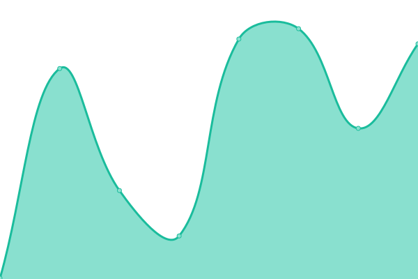
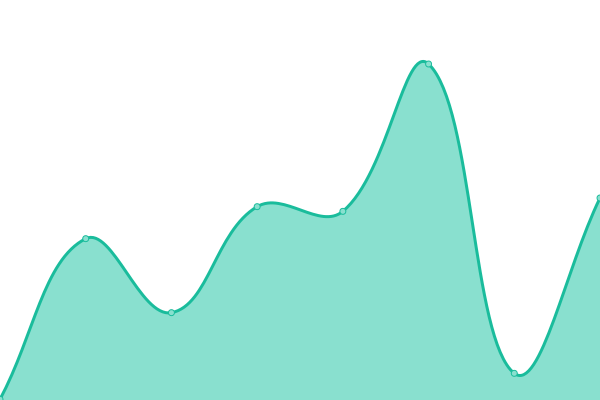
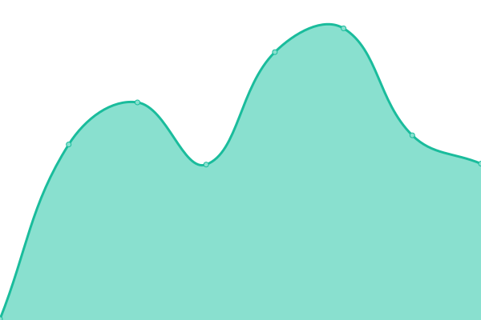

# [📈 在线状态](https://monitor.rdpstudio.top): <!--live status--> **所有系统正常运行**

此仓库包含方糖网络科技的服务状态及其历史数据。

<!--start: status pages-->
<!-- This summary is generated by Upptime (https://github.com/upptime/upptime) -->
<!-- Do not edit this manually, your changes will be overwritten -->
<!-- prettier-ignore -->
| 链接 | 状态 | 历史 | 响应时间 | 正常运行时间 |
| --- | ------ | ------- | ------------- | ------ |
|  ID 方糖通行证 | 🟩 正常运行 | [id.yml](https://github.com/rdpstudio2019/monitor/commits/HEAD/history/id.yml) | 

 945毫秒
     
 | 

<a href="https://monitor.rdpstudio.top/history/id">97.24%</a>
    

|  OAuth2 方糖通行证开放平台授权登录 | 🟩 正常运行 | [o-auth2.yml](https://github.com/rdpstudio2019/monitor/commits/HEAD/history/o-auth2.yml) | 

 693毫秒
     
 | 

<a href="https://monitor.rdpstudio.top/history/o-auth2">97.34%</a>
    

|  CoreTree 核心树 | 🟩 正常运行 | [core-tree.yml](https://github.com/rdpstudio2019/monitor/commits/HEAD/history/core-tree.yml) | 

 646毫秒
     
 | 

<a href="https://monitor.rdpstudio.top/history/core-tree">97.12%</a>
    

|  AutoPatch 下载服务器 | 🟩 正常运行 | [auto-patch.yml](https://github.com/rdpstudio2019/monitor/commits/HEAD/history/auto-patch.yml) | 

 593毫秒
     
 | 

<a href="https://monitor.rdpstudio.top/history/auto-patch">97.11%</a>
    

|  APData 下载存储服务器 | 🟩 正常运行 | [ap-data.yml](https://github.com/rdpstudio2019/monitor/commits/HEAD/history/ap-data.yml) | 

 597毫秒
     
 | 

<a href="https://monitor.rdpstudio.top/history/ap-data">97.11%</a>
    

|  S3 存储服务器 | 🟩 正常运行 | [s3.yml](https://github.com/rdpstudio2019/monitor/commits/HEAD/history/s3.yml) | 

 469毫秒
     
 | 

<a href="https://monitor.rdpstudio.top/history/s3">97.58%</a>
    

|  [Community 方糖社区](https://com.rdpstudio.top) | 🟩 正常运行 | [community.yml](https://github.com/rdpstudio2019/monitor/commits/HEAD/history/community.yml) | 

 817毫秒
     
 | 

<a href="https://monitor.rdpstudio.top/history/community">97.11%</a>
    

|  HyperChat | 🟩 正常运行 | [hyper-chat.yml](https://github.com/rdpstudio2019/monitor/commits/HEAD/history/hyper-chat.yml) | 

 692毫秒
     
 | 

<a href="https://monitor.rdpstudio.top/history/hyper-chat">97.11%</a>
    

|  HiNet Link API | 🟩 正常运行 | [hi-net-link-api.yml](https://github.com/rdpstudio2019/monitor/commits/HEAD/history/hi-net-link-api.yml) | 

 568毫秒
     
 | 

<a href="https://monitor.rdpstudio.top/history/hi-net-link-api">97.01%</a>
    

<!--end: status pages-->

## 📄 协议

- Powered by: [Upptime](https://github.com/upptime/upptime)
- Code: [MIT](./LICENSE) © [方糖网络科技](https://rdpstudio.top)
- Data in the `./history` directory: [Open Database License](https://opendatacommons.org/licenses/odbl/1-0/)
