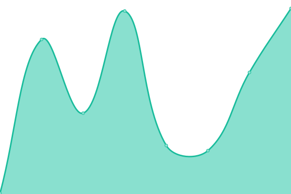
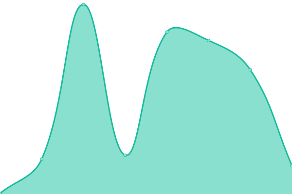

# [📈 Live Status](https://status.rdpstudio.top): <!--live status--> **所有系统正常运行**

This repository contains the open-source uptime monitor and status page for [方糖网络科技](https://rdpstudio.top), powered by [Upptime](https://github.com/upptime/upptime).

With [Upptime](https://upptime.js.org), you can get your own unlimited and free uptime monitor and status page, powered entirely by a GitHub repository. We use [Issues](https://github.com/rdpstudio2019/monitor/issues) as incident reports, [Actions](https://github.com/rdpstudio2019/monitor/actions) as uptime monitors, and [Pages](https://status.rdpstudio.top) for the status page.

<!--start: status pages-->
<!-- This summary is generated by Upptime (https://github.com/upptime/upptime) -->
<!-- Do not edit this manually, your changes will be overwritten -->
<!-- prettier-ignore -->
| 链接 | 状态 | 历史 | 响应时间 | 正常运行时间 |
| --- | ------ | ------- | ------------- | ------ |
|  ID 方糖通行证 | 🟩 正常运行 | [id.yml](https://github.com/rdpstudio2019/monitor/commits/HEAD/history/id.yml) | 

 456毫秒
     
 | 

<a href="https://monitor.rdpstudio.top/history/id">76.44%</a>
    

|  CoreTree 核心树 | 🟩 正常运行 | [core-tree.yml](https://github.com/rdpstudio2019/monitor/commits/HEAD/history/core-tree.yml) | 

 244毫秒
     
 | 

<a href="https://monitor.rdpstudio.top/history/core-tree">76.56%</a>
    

|  [Community 方糖社区](https://com.rdpstudio.top) | 🟩 正常运行 | [community.yml](https://github.com/rdpstudio2019/monitor/commits/HEAD/history/community.yml) | 

 520毫秒
     
 | 

<a href="https://monitor.rdpstudio.top/history/community">100.00%</a>
    

|  HyperChat | 🟩 正常运行 | [hyper-chat.yml](https://github.com/rdpstudio2019/monitor/commits/HEAD/history/hyper-chat.yml) | 

 956毫秒
     
 | 

<a href="https://monitor.rdpstudio.top/history/hyper-chat">76.51%</a>
    

|  AutoPatch 下载服务器 | 🟩 正常运行 | [auto-patch.yml](https://github.com/rdpstudio2019/monitor/commits/HEAD/history/auto-patch.yml) | 

 448毫秒
     
 | 

<a href="https://monitor.rdpstudio.top/history/auto-patch">76.62%</a>
    

|  HiNet Link API | 🟩 正常运行 | [hi-net-link-api.yml](https://github.com/rdpstudio2019/monitor/commits/HEAD/history/hi-net-link-api.yml) | 

 446毫秒
     
 | 

<a href="https://monitor.rdpstudio.top/history/hi-net-link-api">76.64%</a>
    

<!--end: status pages-->

[**Visit our status website →**](https://status.rdpstudio.top)

## 📄 License

- Powered by: [Upptime](https://github.com/upptime/upptime)
- Code: [MIT](./LICENSE) © [方糖网络科技](https://rdpstudio.top)
- Data in the `./history` directory: [Open Database License](https://opendatacommons.org/licenses/odbl/1-0/)
